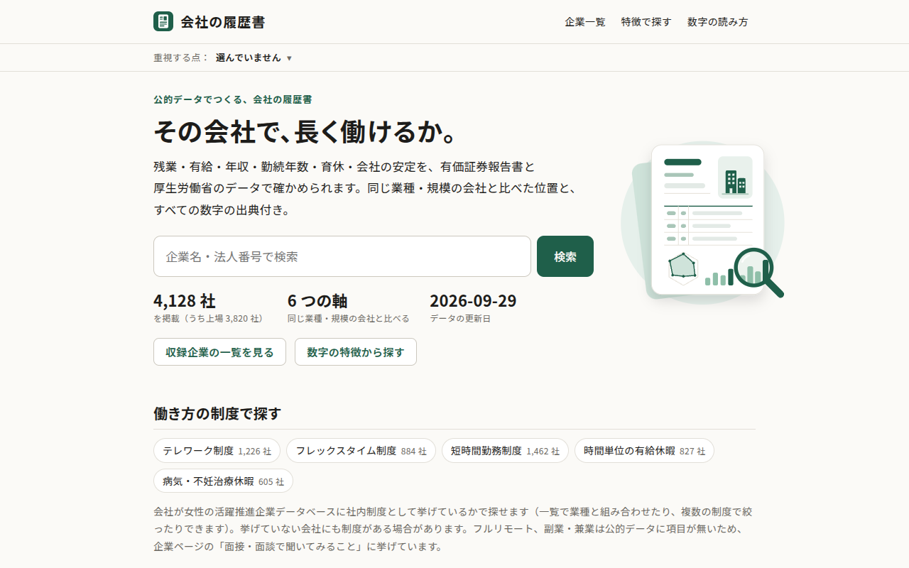
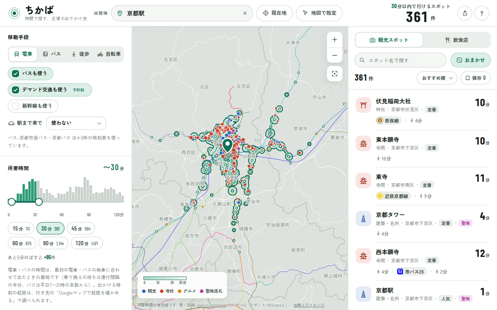
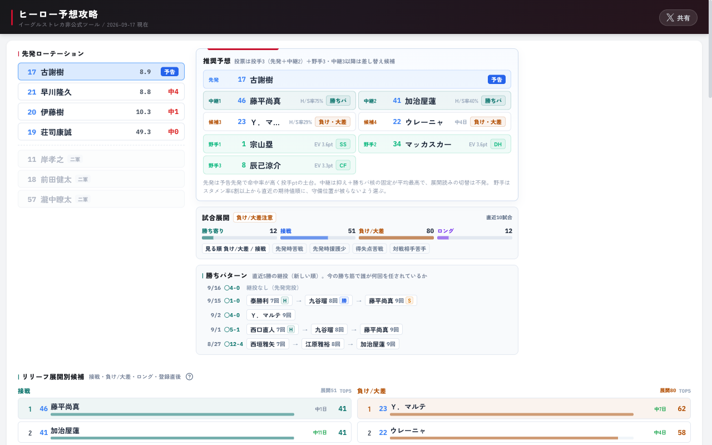
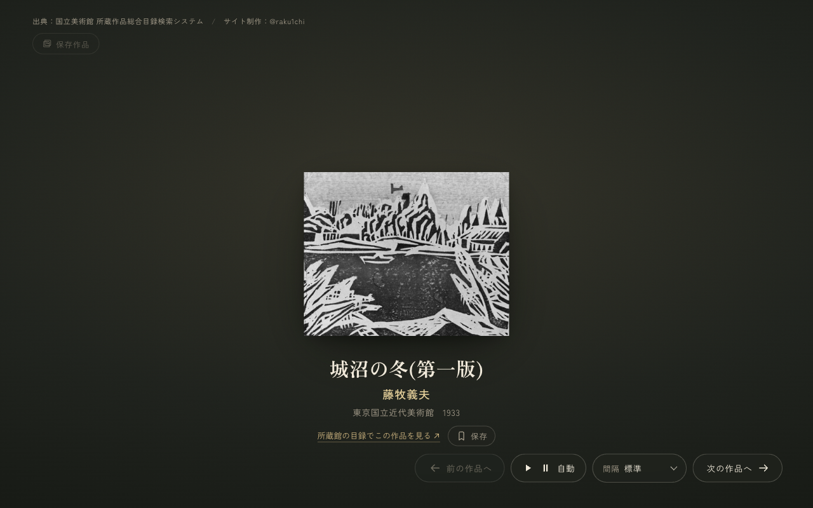

# raku1chi

仕事では Python を中心に、主にバックエンドの開発をしています。 
個人開発では、公的データやオープンデータ、好きなものを題材に、 
「調べる・比べる・眺める」が気持ちよくできる Web サービスを作っています。 
データを集めるところから、設計・API・画面・公開後の運用まで、一通り手を動かすのが好きです。

 

[raku1chi.dev](https://raku1chi.dev) ・ [X](https://x.com/raku1chi)

 

## Works

<table>
  <tr>
    <td width="50%" valign="top">
      
    </td>
    <td width="50%" valign="top">
      
    </td>
  </tr>
  <tr>
    <td valign="top">
      <h3><a href="https://kaisha-rirekisho.raku1chi.dev/">会社の履歴書</a></h3>
      
口コミではなく公的データで、その会社で長く働けるかを確かめる転職者向けの企業データサイト。残業・休暇、定着、育児との両立、収入、会社の安定と成長の 6 つの軸で、同じ業種・規模の会社と比べた位置を出典付きで示します。

      

        
        
        
        
        
      

      
EDINET・厚生労働省・国税庁のオープンデータを法人番号で突き合わせ、Python と DuckDB のパイプラインで指標を算出。生成したデータを R2 に置き、Cloudflare Workers 上の Hono でサーバーサイドレンダリングしています。

    </td>
    <td valign="top">
      <h3><a href="https://chikaba.raku1chi.dev/">ちかば</a></h3>
      
時間から近場のおでかけ先を探す検索サービス。駅・現在地・地図の好きな場所から、電車・バス・徒歩・自転車で◯分以内に行ける観光地・寺社・グルメと街の飲食店を、到達範囲の地図と件数を見ながら絞り込めます。

      

        
        
        
        
        
      

      
OpenStreetMap・Wikipedia・GTFS-JP などのオープンデータから、Python で全国の路線・スポット・飲食店のデータを生成。RAPTOR 方式の経路探索をブラウザ内に実装し、全国どこからでも数十ミリ秒で到達範囲を計算しています。

    </td>
  </tr>
  <tr>
    <td width="50%" valign="top">
      
    </td>
    <td width="50%" valign="top">
      
    </td>
  </tr>
  <tr>
    <td valign="top">
      <h3><a href="https://washi-hero.pages.dev/">ヒーロー予想攻略</a></h3>
      
楽天イーグルスの出場パターンをタイムラインで可視化し、イーグルストレカの「ヒーロー予想」をサポートする非公式ツール。期待値・トレンド・安定・爆発の 4 モードで選手をランキングします。

      

        
        
        
        
      

      
試合データは GitHub Actions で毎日自動更新。ビルド時に静的 JSON へ落とし込み、サーバーレスで配信しています。

    </td>
    <td valign="top">
      <h3><a href="https://artmuseums.pages.dev/">ただ一枚</a></h3>
      
国立美術館 5 館が公開するパブリックドメイン作品を、一点ずつ静かに鑑賞するためのページ。余計な情報を削ぎ落とし、作品と向き合う時間をつくります。

      

        
        
        
      

      
所蔵作品総合目録から Python でデータを収集・整形し、軽量な静的サイトとして公開しています。

    </td>
  </tr>
</table>

 

## Stack

| | |
|:--|:--|
| **Backend / Data** |        |
| **Frontend** |       |
| **Infra / Ops** |        |
| **Testing / Tooling** |       |

